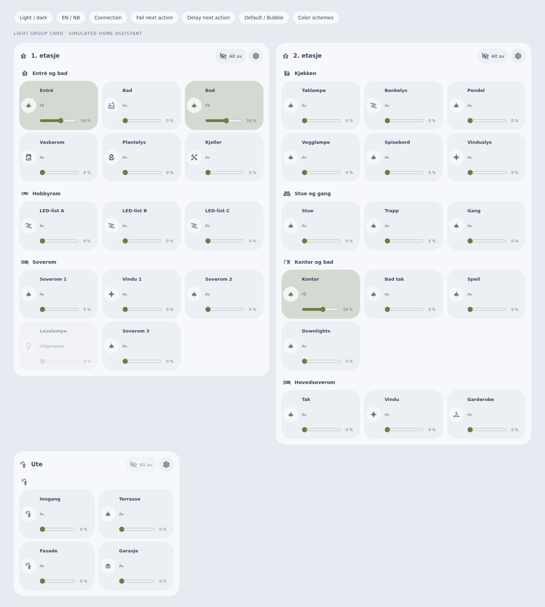

# Light Group Card

A Home Assistant dashboard card for grouped household lighting, with room sections, light controls and zone-wide all off.

Use one card per floor or zone to replace a collection of Bubble light buttons. It works with existing `light.*` entities (including Home Assistant light groups), without Bubble Card or a companion integration. Default and Bubble appearances follow your dashboard, with the same color schemes as the other household cards.



## Install

Add `https://github.com/mvheimburg/lovelace-light-group` to HACS as a **Dashboard** custom repository, then install **Light Group Card**. The resource is `/hacsfiles/lovelace-light-group/light-group-card.js`, type **JavaScript module**. Refresh the browser after installation or upgrade.

For manual installation, copy `dist/light-group-card.js` to `/config/www/light-group-card.js` and register `/local/light-group-card.js` as a JavaScript module under dashboard resources.

## Set up your rooms

Edit the dashboard, add **Light Group Card**, and use its visual editor to:

- Set a floor/zone title and icon.
- Add room sections and select their lights with Home Assistant's entity selectors.
- Reorder rooms and lights, or give them display names and icons.
- Enable **Show room power and brightness controls** separately for each room.
- Choose Default or Bubble appearance and a color scheme.
- Hide or show the **All off** button.
- Enable **Require confirmation for All off** when you want an extra approval step.

Save the dashboard to keep changes. Cancel leaves the saved dashboard untouched. Configuration creates no backend entities or groups and changes no automations. The card's **Configure** cog explains where these options live, including when lights are unavailable. Incomplete new light rows remain editor drafts until a light is selected. An inline warning explains that the latest edits cannot be saved until you select the light or remove that row. Invalid YAML is reported inside the card/editor in the active language, with device actions disabled until the configuration is corrected.

Place floor cards beside each other with the dashboard's own layout. The light grid wraps within each card, down to a single column on narrow screens.

The following IDs are **examples**; replace them with your actual light entities. The screenshot supplied for the design contains names, not entity IDs.

```yaml
type: custom:light-group-card
title: 2. etasje
icon: mdi:home-floor-2
appearance: bubble
color_scheme: home-assistant
sections:
  - name: Kjøkken
    icon: mdi:countertop
    lights:
      - entity: light.example_kitchen_ceiling
        name: Kjøkkentak
        icon: mdi:ceiling-light
      - entity: light.example_kitchen_island
        name: Kjøkkenøy
        icon: mdi:ceiling-light-outline
  - name: Stue og gang
    icon: mdi:sofa
    lights:
      - entity: light.example_living_room
        name: TV-stue
```

| Option | Default | Purpose |
| --- | --- | --- |
| `title` | Lights / Lys | Floor or zone title. |
| `icon` | `mdi:lightbulb-group-outline` | Header icon. |
| `appearance` | `default` | `default` or `bubble`; Bubble Card need not be installed. |
| `color_scheme` | `home-assistant` | Theme colors, or `bright`, `warm`, `mint`, `sky`, `lavender`. The five explicit palettes stay light on a dark dashboard. |
| `show_all_off` | `true` | Show the All off button; set to false to hide it. |
| `confirm_all_off` | `false` | Ask for confirmation before turning off all lights in the card. |
| `sections` | `[]` | Ordered rooms, each with `name`, optional `icon`, and a `lights` array. |
| `sections[].show_controls` | `false` | Show shared on/off and brightness controls for this room. |
| `sections[].lights[].entity` | Required | A `light.*` entity. |
| `sections[].lights[].name` | HA friendly name | Display override; does not rename anything in HA. |
| `sections[].lights[].icon` | Entity icon or lightbulb | Display icon override. |

## Everyday controls

Tap a light's **round icon** to turn it on/off. Dimmable lights have a brightness slider directly on the tile, with a percentage readout. Its name also opens a panel in the card's own style with brightness and more controls. Slider changes are sent on release or keyboard change. **Color lights** also show hue and saturation sliders with a color preview directly in the popup. Color changes are sent on release or keyboard change, using the light’s reported capabilities. The final color follows Home Assistant’s reported value, including device color-range conversion. Tap the **state or brightness readout**, or the **History** icon in the light controls panel, to open the shared history dialog. It shows that light’s on/off lane and reported brightness as a percentage over **6 h, 24 h or 7 d**, with unavailable periods left as gaps. Move over the chart to read past values; legend entries open Home Assistant’s details. History requires Home Assistant recorder data and is bundled with the card, with no separate dashboard resource to install. The **More controls** icon beside Close in the history header opens Home Assistant’s light dialog for temperature and device-specific features. It is disabled when the light is unavailable; history can still be viewed.

Raising brightness from 0 sends `light.turn_on` with the selected `brightness_pct`, including when a light is off. Setting it to 0 requests off through Home Assistant. If a KNX light dims only after a separate power-on, check its absolute dimming address, actuator settings and state feedback in the KNX integration; the card does not send separate KNX telegrams or run a switching sequence.

### Room controls

Enable **Show room power and brightness controls** in a room’s visual editor settings (`sections[].show_controls: true`). The power button turns the room off when any available member is on, or turns available members on when all are off. The card’s **Require confirmation for All off** preference also applies to turning a room off, with that room named in the prompt.

The shared slider sets all available dimmable members to the same brightness, including lights currently off; on/off-only lights are unchanged. The resting slider position is the average of their reported levels, counting off lights as zero. **Mixed** indicates differing levels; unknown brightness is labelled rather than claimed as zero. Room controls affect only the light entities listed in the section, deduplicate repeated entries, and skip unavailable members. They do not discover other Home Assistant area members or create a light group. Existing HA light-group entities retain their own membership behavior. Overlapping requests disable room controls, and failures restore reported values.

Disable **Show All off button** in the visual editor (YAML: `show_all_off: false`) to hide the zone-wide action.

**All off** affects only available, currently on lights listed in this card. Enable **Require confirmation for All off** in the visual card editor (YAML: `confirm_all_off: true`) to show a confirmation dialog naming the floor/zone. Cancel or Escape leaves lights unchanged. Confirmation is off by default. Available lights are checked again when you confirm. Repeated entity IDs are sent once. An existing HA light-group entity retains its normal HA behavior, including controlling its members.

Controls show **Updating…** until the service finishes and Home Assistant confirms the requested state. Overlapping requests are blocked; other lights remain usable. If a request fails or no confirmation arrives within 10 seconds, an error is shown. Brightness returns to the latest HA value on failure. No device state is invented locally. Unavailable/missing lights and disconnected HA data disable device actions; Configure stays accessible.

## Language and accessibility

Card and editor labels follow `hass.language`, then `hass.locale.language`. English and Norwegian Bokmål are supported, including `nb-NO`, underscore/case variants, and legacy `no`. `nn` uses the existing Bokmål fallback, not a separate Nynorsk translation. Unsupported languages use English. Labels update when HA's language changes, while custom names remain untouched.

Percentages use the formatting locale separately from the label dictionary and honor HA number-format preferences. Service values stay numeric. Static card-picker metadata is English because it has no HA language context. Backend error details retain their original wording.

Buttons have accessible names and visible keyboard focus. Dialogs trap focus, close with Escape, and restore focus to their trigger. State is shown with text as well as color. Both light and dark themes are supported.

## Development

```sh
npm ci
npx playwright install chromium
npm test
npm run lint
npm run typecheck
npm run build
npm run dev                 # open /demo/
node scripts/screenshot.cjs  # build first; saves previews under docs/
```

The preview imports the production bundle and uses **simulated** states and services. It does not contact Home Assistant. It includes language/theme switches, failure and pending examples, and mobile/appearance/color-scheme checks. Tests exercise rendered controls, service payloads, request ordering, invalid/missing data, localization and editor events. CI verifies the tracked distribution is current and runs HACS validation.

Version `0.1.2`. Releases run after CI on pushes to `main`, using the package version and attaching `light-group-card.js`. Do not push to `main` until ready to publish.

## Repository metadata

If GitHub metadata has not been set, an authenticated owner can run:

```sh
gh repo edit mvheimburg/lovelace-light-group --description "A Home Assistant dashboard card for grouped household lighting, with room sections, light controls and zone-wide all off." --add-topic home-assistant --add-topic homeassistant --add-topic hacs --add-topic hacs-dashboard --add-topic lovelace --add-topic lovelace-card --add-topic lovelace-custom-card --add-topic lighting
```

## License

GPL-3.0. Build, theme and color-scheme conventions adapted from [Thermostat Valve Card](https://github.com/mvheimburg/lovelace-thermostat-valve), also GPL-3.0. See [LICENSE](LICENSE).
